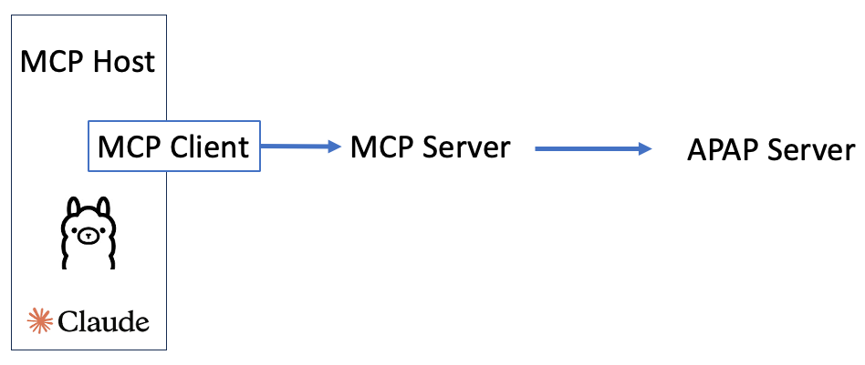

# Accord Project Agent Interface
This project is a MCP server that can be used to communicate with the Accord Project Agreement Protocol (APAP) OpenAPI specificatiion as defined in https://github.com/accordproject/apap.


Screenshot of Claude Desktop querying an agreement


## Operation of the Server
The MCP server is involked by an LLM when it needs to interact with the Agreement Server to allow read and write operations on templates and agreements. This allows twemplates agreements to be queried and created.

### Architecture

Here is an example sequence of operations:


## Building the project:
The project needs to be compiled from TypeScript to JavaScript by running the following:
```bash
npm run build
```

This needs to be run each time there is a code change.
Note that Claude Desktop needs to be restarted to pick up new code changes for the MCP Server.

## Running in Claude Desktop
For Claude Desktop the Claude configuration file called claude_desktop_config.json in a Mac this can be found by default in /Users/yourusername/Library/Application Support/Claude and it needs to be configured as follows:

1. args should point to the MCP server implementation. This is the absolute path to the apap.js file that will be generated by the compilation process
2. APAP_BASE_URL pointing to the APAP server url including a port number
3. Depending on the implementation for the APAP Server a valid JWT_TOKEN may be needed

### Configuration Details for Claude:
```json

{
  "mcpServers": {

    "Accord": {
      "command": "node",
         "args": [
            "path/to/mcp/build/apap.js"
          ],
          "env": {
            "APAP_BASE_URL":"",
            "JWT_TOKEN":""
          }
      }
    }
}
```

Once configured, when Claude is started there should be a hammer icon at the bottom of the chat window that when pressed should contain the various tools implemented by this MCP server in list of Available MCP tools.

A user confirmation is generally required before the MCP trigger is called. 
NB use with care to avoid accidently triggering an agreement by mistake or with incorrect data.

## Debugging the MCP Server
The MCP Server can be debugged by testing with the MCP Inspector tool
this ca be run from a terminal after setting any required env variables and instaling the 
@modelcontextprotocol/inspector tool and then running the following command frm the root of the project

```bash
npx @modelcontextprotocol/inspector node build/apap.js
```

This will open a web interface locally on port 6274. Click connect and the window on the bottom left shoudl display debug output from the MCP Server. If the inspector cannot connect to the MCP server stop the npx @modelcontextprotocol/inspector node build/apap.js and start again and wait a couple of seconds, refresh the web inspector web page and try to connect again.

The tabs along the top of the server will list the available prompts that the Server will return to the MCP Host and the available resources and tools. When List Resources is pressed the inspector tool will attempt to list the ids of all available templates and agreeemnts and then fetch each template and agreement.

If there are errors showing with the MCP server in Clause, or the tool and socket icons are not showing:
1. there are log files /Users/niall/Library/Logs/Claude folder, a general log file called mcp.log and a log file for each individual mcp server
2. Open the menu for Claude -> Settings -> Developer and look to make t=sure the MCP server is listed
3. If the server is listed make sure that when clicked it is showing as running and the environment variables look as expected
4. If the server does not work consider that Clause starts the server in a default shell that may not have the same configuration to the shell used for development and testing

## Using the MCP Server with prompts
As per the inspector tool Claude will attempt to retrieve all templates and agreeemnts as resources. These files are available to add to a chat context when clicking the button that looks like two connecting plugs and choosing a template or agreeemnt id. This will add some of the meta data for the selected template or agreement to the chat. The LLM may also retrieve templates or agreeemnts using the defined tool methods such as View Agreement or Create Template. A list of these tools can be seen when pressing the hammer icon.

## LLM-driven APAP Workflow
A typical workflow possible via instructions to the LLM could be as follows:
1. Review existing templates and agreements (if present)
2. Check the state of an agreement (if present)
3. Create new templates and agreements
4. Triggering agreements (if supported by the agreement)
5. Check the new state of an agreement if modified by the trigger operation
6. other methods such as delete agreement/template have not been implemented for safety reasons but are avaialble in the APAP protocol.